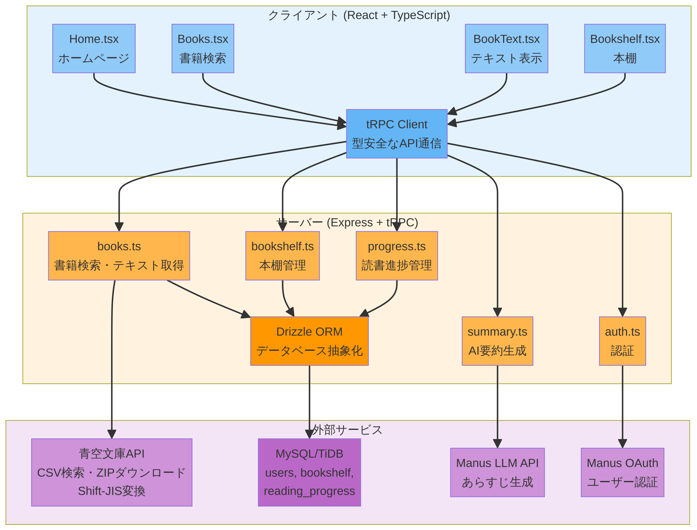

# 🧵 青空文庫リーダー


日本の著作権が切れた文学作品を、PCやスマホで快適に読むことができるリーダーアプリです📱。Manus LLMによる、作品のあらすじ（要約）生成機能を実装しました。

**公開リンク：** [https://aozora.manus.space](https://aozora.manus.space)

---

## 📖 概要

青空文庫リーダーは、[青空文庫](https://www.aozora.gr.jp/)が提供する18,000件以上の著作権フリーの日本文学作品を、快適に検索・閲覧できるWebアプリケーションです。夏目漱石、芥川龍之介、太宰治などの名作を無料で読むことができ、AI要約機能、本棚管理、読書進捗保存など、現代的な読書体験を提供します。

---

## ✨ 主な機能

### 📚 作品検索・閲覧
- **全作品網羅**: 青空文庫の全作品（18,000件以上）を検索可能
- **柔軟な検索**: 作品名・著者名での検索に対応
- **ページネーション**: 検索結果を20件ずつ表示し、快適にブラウジング
- **人気作品表示**: 初期画面で人気作品を表示

### 📖 快適な読書体験
- **美しい日本語表示**: Shift-JISからUTF-8への適切な変換により、文字化けのない美しい日本語テキスト
- **フォントサイズ調整**: 4段階（小・中・大・特大）のフォントサイズから選択可能
- **ライト/ダークモード**: 環境や好みに合わせて表示モードを切り替え
- **読書進捗保存**: スクロール位置を自動保存し、次回読書時に復元

### 🤖 AI機能
- **あらすじ生成**: Manus LLMを活用した作品のあらすじ（要約）自動生成
- **あらすじ保存**: 生成したあらすじを本棚に保存し、後から閲覧可能

### 📚 本棚機能（ログインユーザー向け）
- **お気に入り管理**: 気に入った作品を本棚に追加・削除
- **読書履歴**: 読んだ作品の履歴を自動記録
- **あらすじ保存**: AIが生成したあらすじを本棚に保存

### 🎨 ユーザー体験
- **レスポンシブデザイン**: PC・スマートフォン・タブレットに対応
- **直感的なUI**: shadcn/uiコンポーネントによる洗練されたインターフェース
- **SEO最適化**: OGP画像、メタタグの設定により、SNSシェア時に美しく表示

---

## 🛠️ 技術スタック

### フロントエンド
- **React 19**: 最新のReactによるコンポーネント設計
- **TypeScript**: 型安全な開発環境
- **Tailwind CSS 4**: ユーティリティファーストのCSSフレームワーク
- **shadcn/ui**: 洗練されたUIコンポーネントライブラリ
- **tRPC**: エンドツーエンドの型安全なAPI通信
- **Vite**: 高速なビルドツール

### バックエンド
- **Node.js 22**: 最新のNode.js環境
- **Express 4**: Webアプリケーションフレームワーク
- **tRPC 11**: 型安全なRPCフレームワーク
- **Drizzle ORM**: TypeScript-firstのORMライブラリ

### データベース
- **MySQL/TiDB**: リレーショナルデータベース
- **テーブル構成**:
  - `users`: ユーザー情報
  - `bookshelf`: 本棚（お気に入り作品、保存されたあらすじ）
  - `reading_progress`: 読書進捗（スクロール位置、読書履歴）

### 外部API・サービス
- **青空文庫API**: 公式CSVファイル（`list_person_all_extended_utf8.zip`）から作品情報を取得
- **青空文庫テキストファイル**: ZIPファイルをダウンロードしてShift-JISテキストを解凍・変換
- **Manus LLM API**: AI要約生成に使用
- **Manus OAuth**: ユーザー認証

### 開発ツール
- **pnpm**: 高速なパッケージマネージャー
- **tsx**: TypeScriptの実行環境
- **ESLint**: コード品質チェック
- **Prettier**: コードフォーマッター

---

## 🏗️ アーキテクチャ

### システム構成図



### 詳細構成

```
┌─────────────────────────────────────────────────────────────┐
│                         クライアント                          │
│  ┌─────────────────────────────────────────────────────┐   │
│  │  React 19 + TypeScript + Tailwind CSS              │   │
│  │  ┌──────────┐  ┌──────────┐  ┌──────────┐         │   │
│  │  │ Home.tsx │  │Books.tsx │  │BookText  │         │   │
│  │  │          │  │          │  │.tsx      │         │   │
│  │  └──────────┘  └──────────┘  └──────────┘         │   │
│  │  ┌──────────┐  ┌──────────┐                       │   │
│  │  │Bookshelf │  │tRPC      │                       │   │
│  │  │.tsx      │  │Client    │                       │   │
│  │  └──────────┘  └──────────┘                       │   │
│  └─────────────────────────────────────────────────────┘   │
└─────────────────────────────────────────────────────────────┘
                            │
                            │ tRPC (型安全なAPI通信)
                            ▼
┌─────────────────────────────────────────────────────────────┐
│                      サーバー (Express)                       │
│  ┌─────────────────────────────────────────────────────┐   │
│  │  tRPC Router                                        │   │
│  │  ┌──────────┐  ┌──────────┐  ┌──────────┐         │   │
│  │  │ books.ts │  │bookshelf │  │progress  │         │   │
│  │  │          │  │.ts       │  │.ts       │         │   │
│  │  └──────────┘  └──────────┘  └──────────┘         │   │
│  │  ┌──────────┐  ┌──────────┐                       │   │
│  │  │ summary  │  │ auth.ts  │                       │   │
│  │  │.ts       │  │          │                       │   │
│  │  └──────────┘  └──────────┘                       │   │
│  └─────────────────────────────────────────────────────┘   │
│                            │                                │
│                            ▼                                │
│  ┌─────────────────────────────────────────────────────┐   │
│  │  Drizzle ORM (db.ts)                                │   │
│  └─────────────────────────────────────────────────────┘   │
└─────────────────────────────────────────────────────────────┘
                            │
        ┌───────────────────┼───────────────────┐
        │                   │                   │
        ▼                   ▼                   ▼
┌──────────────┐  ┌──────────────┐  ┌──────────────┐
│  MySQL/TiDB  │  │ 青空文庫API   │  │ Manus LLM    │
│              │  │              │  │ API          │
│  - users     │  │ - CSV検索    │  │              │
│  - bookshelf │  │ - ZIPダウン  │  │ - あらすじ   │
│  - reading_  │  │   ロード     │  │   生成       │
│    progress  │  │ - Shift-JIS  │  │              │
│              │  │   変換       │  │              │
└──────────────┘  └──────────────┘  └──────────────┘
```

### データフロー

#### 1. 作品検索フロー
```
ユーザー入力
  ↓
Books.tsx (検索UI)
  ↓
tRPC Client (books.search)
  ↓
books.ts Router
  ↓
青空文庫CSV (list_person_all_extended_utf8.zip)
  ↓
CSVパース・フィルタリング
  ↓
検索結果をクライアントに返却
  ↓
Books.tsx (結果表示)
```

#### 2. テキスト表示フロー
```
ユーザーが「読む」をクリック
  ↓
BookText.tsx
  ↓
tRPC Client (books.getText)
  ↓
books.ts Router
  ↓
青空文庫ZIPファイルダウンロード (fetch API)
  ↓
AdmZipで解凍
  ↓
Shift-JIS → UTF-8変換 (iconv-lite)
  ↓
テキストをクライアントに返却
  ↓
BookText.tsx (テキスト表示)
```

#### 3. AI要約生成フロー
```
ユーザーが「あらすじ」ボタンをクリック
  ↓
BookText.tsx
  ↓
tRPC Client (summary.generate)
  ↓
summary.ts Router
  ↓
Manus LLM API (invokeLLM)
  ↓
AI生成されたあらすじを返却
  ↓
BookText.tsx (ポップアップ表示)
  ↓
ユーザーが「保存」をクリック
  ↓
tRPC Client (bookshelf.saveSummary)
  ↓
bookshelf.ts Router
  ↓
MySQL/TiDB (bookshelfテーブルに保存)
```

#### 4. 本棚・読書進捗フロー
```
ユーザーが作品を本棚に追加
  ↓
tRPC Client (bookshelf.add)
  ↓
bookshelf.ts Router
  ↓
MySQL/TiDB (bookshelfテーブルに挿入)

読書中にスクロール
  ↓
BookText.tsx (スクロール位置を監視)
  ↓
tRPC Client (progress.save)
  ↓
progress.ts Router
  ↓
MySQL/TiDB (reading_progressテーブルに保存)
```

---

## 📁 プロジェクト構成

```
aozora-reader-deploy/
├── client/                      # フロントエンド
│   ├── public/                  # 静的ファイル
│   │   └── ogp-image.png        # OGP画像
│   ├── src/
│   │   ├── pages/               # ページコンポーネント
│   │   │   ├── Home.tsx         # ホームページ
│   │   │   ├── Books.tsx        # 書籍検索ページ
│   │   │   ├── BookText.tsx     # テキスト表示ページ
│   │   │   └── Bookshelf.tsx    # 本棚ページ
│   │   ├── components/          # 再利用可能なコンポーネント
│   │   │   └── ui/              # shadcn/uiコンポーネント
│   │   ├── lib/
│   │   │   └── trpc.ts          # tRPCクライアント設定
│   │   ├── App.tsx              # ルーティング設定
│   │   ├── main.tsx             # エントリーポイント
│   │   └── index.css            # グローバルスタイル
│   └── index.html               # HTMLテンプレート
├── server/                      # バックエンド
│   ├── routers/                 # tRPCルーター
│   │   ├── books.ts             # 書籍検索・テキスト取得
│   │   ├── bookshelf.ts         # 本棚管理
│   │   ├── progress.ts          # 読書進捗管理
│   │   └── summary.ts           # AI要約生成
│   ├── db.ts                    # データベースヘルパー
│   ├── routers.ts               # ルーター統合
│   └── _core/                   # フレームワークコア
│       ├── index.ts             # サーバーエントリーポイント
│       ├── trpc.ts              # tRPC設定
│       ├── llm.ts               # Manus LLM統合
│       └── oauth.ts             # Manus OAuth統合
├── drizzle/                     # データベース
│   └── schema.ts                # データベーススキーマ
├── shared/                      # 共有型定義
├── package.json                 # 依存関係
├── tsconfig.json                # TypeScript設定
├── tailwind.config.ts           # Tailwind CSS設定
├── todo.md                      # タスク管理
└── README.md                    # このファイル
```

---

## 🗄️ データベーススキーマ

### users テーブル
ユーザー情報を管理します。

| カラム名 | 型 | 説明 |
|---------|-----|------|
| id | int (PK, AUTO_INCREMENT) | ユーザーID |
| openId | varchar(64) (UNIQUE) | Manus OAuth識別子 |
| name | text | ユーザー名 |
| email | varchar(320) | メールアドレス |
| loginMethod | varchar(64) | ログイン方法 |
| role | enum('user', 'admin') | ユーザーロール |
| createdAt | timestamp | 作成日時 |
| updatedAt | timestamp | 更新日時 |
| lastSignedIn | timestamp | 最終ログイン日時 |

### bookshelf テーブル
ユーザーの本棚（お気に入り作品）を管理します。

| カラム名 | 型 | 説明 |
|---------|-----|------|
| id | int (PK, AUTO_INCREMENT) | 本棚ID |
| userId | int (FK → users.id) | ユーザーID |
| bookId | varchar(255) | 作品ID（青空文庫の作品番号） |
| title | text | 作品タイトル |
| author | text | 著者名 |
| textUrl | text | テキストファイルURL |
| summary | text (NULL) | 保存されたあらすじ |
| createdAt | timestamp | 追加日時 |

### reading_progress テーブル
読書進捗（スクロール位置、読書履歴）を管理します。

| カラム名 | 型 | 説明 |
|---------|-----|------|
| id | int (PK, AUTO_INCREMENT) | 進捗ID |
| userId | int (FK → users.id) | ユーザーID |
| bookId | varchar(255) | 作品ID（青空文庫の作品番号） |
| title | text | 作品タイトル |
| author | text | 著者名 |
| scrollPosition | float | スクロール位置（0.0〜1.0） |
| lastReadAt | timestamp | 最終読書日時 |
| createdAt | timestamp | 作成日時 |

---

## 🚀 セットアップ・開発

### 前提条件
- Node.js 22以上
- pnpm
- MySQL/TiDB データベース

### インストール

```bash
# リポジトリをクローン
git clone <repository-url>
cd aozora-reader-deploy

# 依存関係をインストール
pnpm install
```

### 環境変数

以下の環境変数が自動的に注入されます（Manusプラットフォーム）：

```
DATABASE_URL              # データベース接続文字列
JWT_SECRET                # セッションCookie署名シークレット
VITE_APP_ID               # Manus OAuth アプリケーションID
OAUTH_SERVER_URL          # Manus OAuth バックエンドURL
VITE_OAUTH_PORTAL_URL     # Manus ログインポータルURL
BUILT_IN_FORGE_API_URL    # Manus LLM API URL
BUILT_IN_FORGE_API_KEY    # Manus LLM APIキー
VITE_APP_TITLE            # アプリタイトル
VITE_APP_LOGO             # アプリロゴURL
```

### データベースマイグレーション

```bash
# データベーススキーマをプッシュ
pnpm db:push
```

### 開発サーバー起動

```bash
# 開発サーバーを起動
pnpm dev

# ブラウザで http://localhost:3000 にアクセス
```

### ビルド

```bash
# 本番用ビルド
pnpm build

# 本番サーバー起動
pnpm start
```

---

## 🎨 デザインシステム

### カラーパレット
- **背景色**: 淡いブルーグレー（#F0F4F8）
- **カード背景**: ホワイト（#FFFFFF）
- **プライマリカラー**: インディゴ（#6366F1）
- **テキストカラー**: ダークグレー（#1F2937）
- **アクセントカラー**: アンバー（#F59E0B）

### タイポグラフィ
- **フォントファミリー**: システムフォント（-apple-system, BlinkMacSystemFont, "Segoe UI", Roboto, sans-serif）
- **日本語フォント**: ヒラギノ角ゴ、游ゴシック、メイリオなど

### レスポンシブブレークポイント
- **モバイル**: 〜640px
- **タブレット**: 641px〜1024px
- **デスクトップ**: 1025px〜

---

## 🔒 セキュリティ

- **認証**: Manus OAuthによる安全なユーザー認証
- **セッション管理**: JWT署名付きCookieによるセッション管理
- **API保護**: tRPCの`protectedProcedure`により、ログインユーザーのみがアクセス可能なAPIを保護
- **データベース**: Drizzle ORMによるSQLインジェクション対策
- **環境変数**: 機密情報は環境変数で管理し、コードにハードコードしない

---

## 📊 パフォーマンス最適化

- **コード分割**: Viteによる自動コード分割
- **遅延ローディング**: React.lazyによるコンポーネントの遅延ローディング
- **キャッシング**: tRPCのクエリキャッシングによる不要なAPI呼び出しの削減
- **画像最適化**: OGP画像の適切なサイズ設定
- **データベースインデックス**: userIdとbookIdにインデックスを設定

---

## 🧪 テスト

```bash
# ユニットテストを実行
pnpm test

# テストカバレッジを確認
pnpm test:coverage
```

---

## 📝 ライセンス

このプロジェクトはMITライセンスの下で公開されています。

---

## 🙏 謝辞

- **青空文庫**: 著作権フリーの日本文学作品を提供していただいています
- **Manus**: LLM API、OAuth、ホスティングプラットフォームを提供していただいています
- **shadcn/ui**: 美しいUIコンポーネントライブラリを提供していただいています

---

## 📧 お問い合わせ

質問や提案がある場合は、[Issues](https://github.com/your-repo/issues)でお知らせください。

---

## 🔮 今後の機能追加予定

1. **縦書き表示モード** - 伝統的な日本語の縦書きレイアウトオプション
2. **読書統計ダッシュボード** - 読んだ本の数、総読書時間、お気に入りの著者などの統計表示
3. **ソーシャルシェア機能** - 本やあらすじをTwitter/Facebookで簡単にシェア
4. **あらすじ編集・削除機能** - 保存したあらすじの編集・削除
5. **ソート機能** - 検索結果を出版日、著者名、タイトルでソート
6. **ジャンル・カテゴリフィルター** - NDC分類（小説、詩、エッセイなど）でフィルタリング

---

**Made with 🩵 by Manus Platform**
